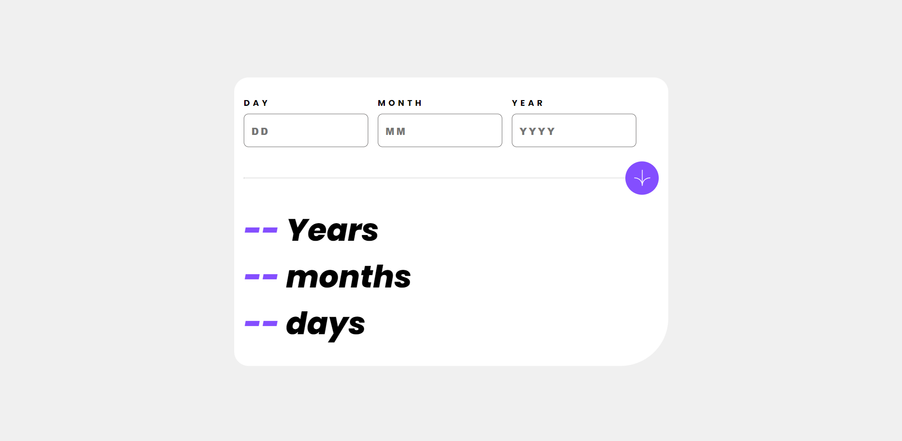

# Frontend Mentor - Age calculator app solution

This is a solution to the [Age calculator app challenge on Frontend Mentor](https://www.frontendmentor.io/challenges/age-calculator-app-dF9DFFpj-Q). Frontend Mentor challenges help you improve your coding skills by building realistic projects. 

## Table of contents

- [Overview](#overview)
  - [The challenge](#the-challenge)
  - [Screenshot](#screenshot)
  - [Links](#links)
- [My process](#my-process)
  - [Built with](#built-with)
  - [What I learned](#what-i-learned)


**Note: Delete this note and update the table of contents based on what sections you keep.**

## Overview

### The challenge

Users should be able to:

- View an age in years, months, and days after submitting a valid date through the form
- Receive validation errors if:
  - Any field is empty when the form is submitted
  - The day number is not between 1-31
  - The month number is not between 1-12
  - The year is in the future
  - The date is invalid e.g. 31/04/1991 (there are 30 days in April)
- View the optimal layout for the interface depending on their device's screen size
- See hover and focus states for all interactive elements on the page
- **Bonus**: See the age numbers animate to their final number when the form is submitted

### Screenshot

**Desktop View**


**Mobile View**


### Links

- Solution URL: [Add solution URL here](https://your-solution-url.com)
- Live Site URL: [Add live site URL here](https://your-live-site-url.com)

## My process

### Built with

- Semantic HTML5 markup
- CSS custom properties
- Flexbox
- Mobile-first workflow
- Javascript

**Note: These are just examples. Delete this note and replace the list above with your own choices**

### What I learned

This is my second project that implement javascript, its quite challenging because of the goals of this project to show age in years,month,and days.

The challenge for me from this project is to calculate the years,month, and days. A lot of googling to find the formula and implement it and of course to understand it to. 

Another challenge is grouping the month based on the date using object, because some of the month only have 30 day and other is 31.

Also another challenge for me is how to validate per input field for every click, so fpr i achieve that goals i make for statement for each input field, example below : 
```js
if(day.value === '' ){
        showError(dayError)
        dayError.textContent = "This field is required"
        dayErrorTrue = 1
    }
    else if(inputDay < 0 || inputDay >31){
        showError(dayError)
        dayError.textContent = "The day number is not between 1-31"
        dayErrorTrue = 1
    }else{
        dayError.classList.add('hidden')
        dayErrorTrue = 0

    }
```

On this challenge i also try to implement DRY, by creating a simple function to show an error. And of course a lot of code that can be refactor but maybe later i will refactor it

Some of the code that i like hehehee
```js
function showError(errorType){
    errorType.classList.remove('hidden');
}
```
and theres a lot of learning from this project that i got


## Author

- Frontend Mentor - [@fareldeksano](https://www.frontendmentor.io/profile/digiT000)
- LinkedIn - [@fareldeksano](https://www.linkedin.com/in/fareldeksano/)
